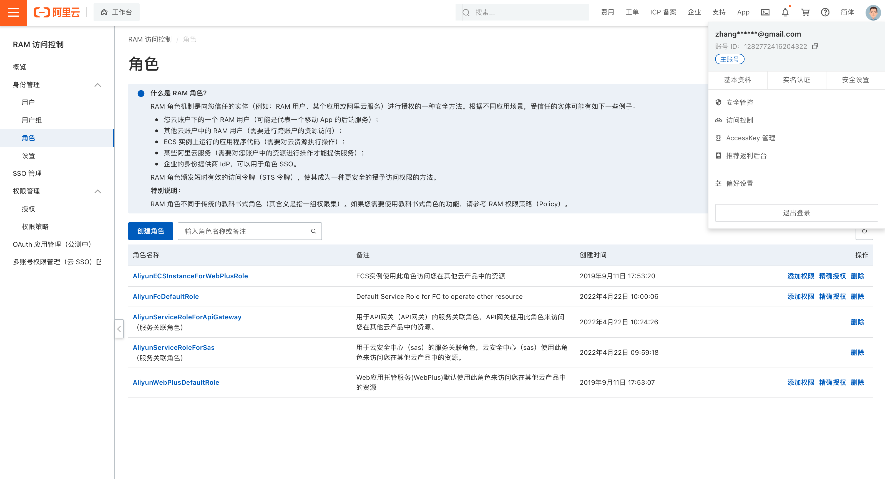

# Aliyun操作指南

[TOC]

## 1. 创建临时Token服务

### 1.1 创建RAM角色并授权
为了能够正常使用Sts Token，需要创建可以授权的RAM角色。登录阿里云控制台后，点击用户头像，选择“访问控制”，点击进入"角色"模块:


点击"创建角色"后，选择创建"阿里云账号"角色，然后"下一步":


输入角色名称，例如"OSSReadonlyRole"，并选择信任的云账号，这里可以选择"当前云账号"。如果OSS的权限在其他子账号，也可以选择"其他云账号"。然后"下一步":


角色创建完成后，点击"为角色授权"，进行授权:


在授权页面搜索栏中输入"OSS"可以搜索到跟OSS相关的全部权限，这里只需要双击选择"只读访问对象存储服务（OSS）的权限"即可:


授权完成后，点击"完成"：


可以在角色页面查看到我们新创建的"OSSReadonlyRole"这个角色：


点击"OSSReadonlyRole"角色名，可以进入到角色详情，这里可以看到只给用户授权了OSS的只读权限。需要注意，在角色详情页面中，有个"ARN"，需要将该值保留下来，后续会用到。


至此，RAM角色已经创建完成。后续我们会创建相应的函数计算利用该角色生成StS Token。

## 1.2 创建函数计算FC

下面开始创建生成Sts Token的fc函数。首先要创建一个FC服务，在函数计算FC控制台，选择"服务及函数"，并选择好要创建服务的地域，例如这里选择"华北（北京）"，然后点击"创建服务":


在创建服务的页面，输入服务名，例如这输入"sts-token-service"，并打开日志功能和链路追踪功能，这两个功能可能会产生费用，如果觉得不需要也可以关闭。


服务创建成功后，可以开始创建函数，在服务详情页面，点击"创建函数"：


在创建函数页面选择"使用模板创建"，并在模板中选择python版本的"return-apigateway-string"模板：


输入函数名，例如"sts-token-fc"，并选择"弹性实例"，其他保持不变，点击"完成"


创建完成后，页面会跳转到云IDE环境，这里会有两个文件，index.js 和 [index.py](../src/aliyun/index.py)，我们需要编辑的是 [index.py](../src/aliyun/index.py)，如下代码所示：

``` python
import logging
import json

import oss2
from aliyunsdkcore.client import AcsClient
from aliyunsdkcore.acs_exception.exceptions import ClientException
from aliyunsdkcore.acs_exception.exceptions import ServerException
from aliyunsdksts.request.v20150401.AssumeRoleRequest import AssumeRoleRequest

accessKeyId = 'xxxxxxx' #替换为您的AccessKeyId
accessSecret = 'xxxxxxx' #替换为您的AccessSecret

def handler(event, context):
  try:
    acsClient = AcsClient(accessKeyId, accessSecret, 'cn-beijing')
    request = AssumeRoleRequest()
    request.set_accept_format('json')
    request.set_RoleArn("acs:ram::xxxxxx:role/xxxxxx") #替换为角色的ARN值
    request.set_RoleSessionName("migration_role")
    response = acsClient.do_action_with_exception(request)
    content = str(response, encoding='utf-8')
  except Exception as e:
    content = "occur exceptions"

  api_rep = {
    "isBase64Encoded":"false",
    "statusCode":"200",
    #"headers":{"x-custom-header":"your header"},
    "body":content
  }
  return json.dumps(api_rep)
```

填入正确的值后，点击IDE中的"保存并部署"，然后点击"调用"，看看返回结果是否正常，如图所示表示函数工作正常：
